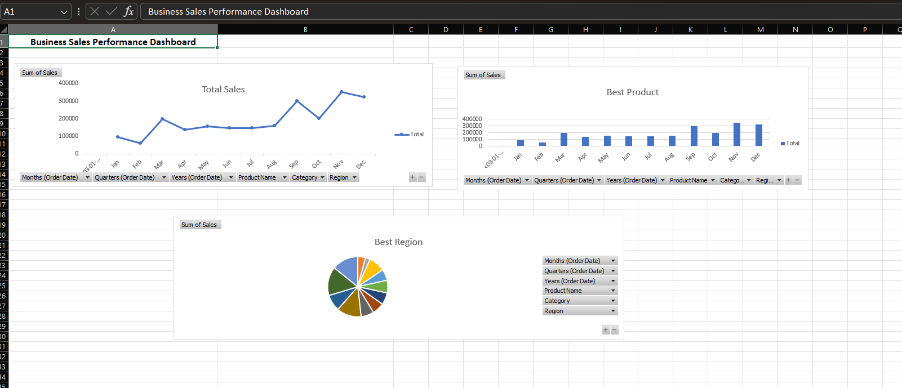

# Business Sales Performance Analytics

## Overview
This project analyzes business sales data using Microsoft Excel.

## Tools Used
- Excel
- Pivot Tables
- Charts
- Dashboard

## Key Insights
- November had highest sales
- Technology category generated highest revenue
- West region performed best

## Dashboard Preview

## Skills Learned
- Data Cleaning
- Sales Analysis
- Dashboard Design
- Business Insights
